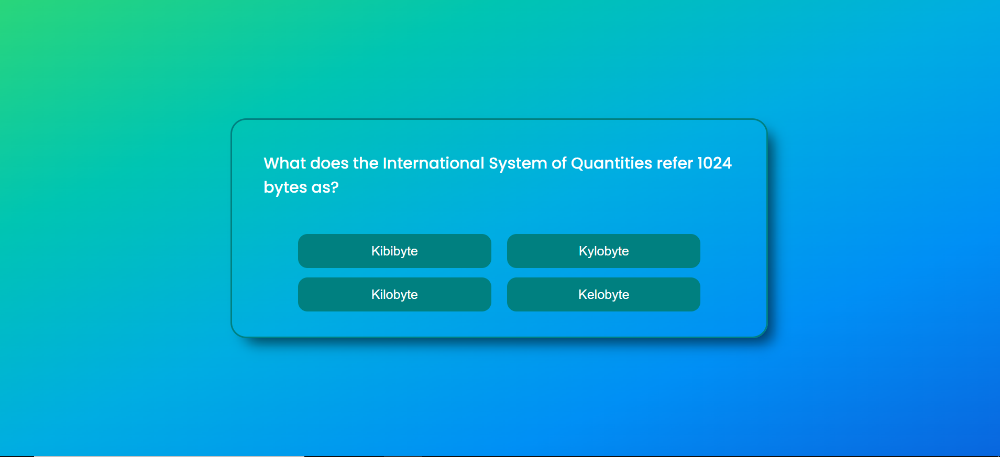

# Trivia-JavaScript

Trivia of different topics (made with vanilla js).

# Deployment

VERCEL: 

[LINK](https://trivia-javasript.vercel.app/)

## Screenshots

## Libraries

1.  [HTML](https://developer.mozilla.org/en-US/docs/Web/HTML)
2.  [CSS](https://developer.mozilla.org/en-US/docs/Web/CSS)
2.  [JavaScript](https://developer.mozilla.org/en-US/docs/Web/JavaScript)

## Install and run project

1. Clone repo.
2. Install live server.
3. Open with live server.
